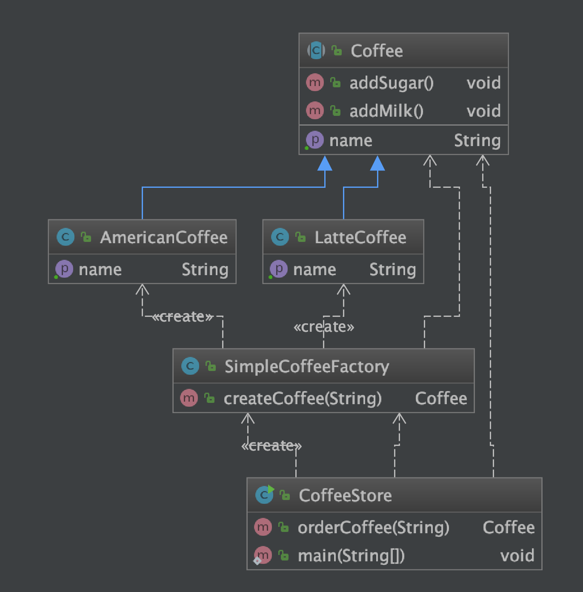

# 概述
工厂模式是一种对象创建型模式，它提供了一种创建对象的最佳实践。在工厂模式中，我们在创建对象时不使用 new 关键字，而是通过调用工厂方法来创建对象。工厂方法是一种在子类中定义的方法，该方法负责实例化对象。工厂方法可以返回不同的对象类型，因此工厂模式可以创建一组相关或不相关的对象。这样就可以将对象的创建和使用解耦。

# 简介

工厂模式有三种类型：简单工厂模式、工厂方法模式和抽象工厂模式。

- 简单工厂模式是最基本的工厂模式，它通过一个工厂类来创建所有需要的对象。简单工厂模式将对象的创建逻辑封装在一个工厂类中，客户端通过调用工厂类的静态方法来创建对象。
- 工厂方法模式是对简单工厂模式的改进，它定义了一个用于创建对象的接口或抽象类，让子类决定实例化哪一个类。工厂方法模式将对象的创建过程延迟到子类中进行，从而实现了开闭原则
- 抽象工厂模式是对工厂方法模式的扩展，它提供了一个创建一系列相关或相互依赖对象的接口或抽象类，而无需指定它们具体的类。抽象工厂模式可以创建多个产品族，每个产品族由多个具体产品组成。

# 优缺点

## 优点
- 可以将对象的创建和使用解耦，从而提高系统的灵活性和可维护性。
- 工厂模式可以隐藏对象的创建细节，使客户端只关心对象的使用，从而降低系统的复杂度。
- 工厂模式可以实现开闭原则，当需要增加新的产品时，只需要增加相应的工厂类即可，无需修改原有代码。

## 缺点
- 工厂模式会增加系统中类的数量，当产品类型较多时，会导致系统过于庞大和复杂。
- 工厂模式需要引入抽象层，这会增加系统的抽象性和理解难度。
- 工厂模式可能会导致类层次过多，增加系统设计难度。

# 应用场景
- 当需要创建的对象类型较多时，可以使用工厂模式来避免大量的new操作。
- 当需要根据不同的条件或参数来创建不同类型的对象时，可以使用工厂模式来实现条件分支的替代。
- 当需要将对象的创建和使用解耦时，可以使用工厂模式来实现依赖倒置原则。

# 抽象工厂与工厂模式的对比

抽象工厂模式是工厂方法模式的升级版本，它们之间有以下几个区别：

- 粒度不同：抽象工厂模式关注一族相关对象的创建，一个工厂负责创建一族产品对象；而工厂方法模式关注单个对象的创建，每个工厂只负责创建一种产品。
- 抽象程度不同：抽象工厂模式具有更高的层次和更大的封装性，它通过引入抽象工厂和具体工厂的概念，将一族产品对象的创建交给抽象工厂来完成；而工厂方法模式的抽象程度相对较低，它通过定义一个工厂接口或抽象类来声明创建产品的方法，然后具体工厂类会实现这个接口或抽象类来创建具体产品对象。
- 关注点不同：抽象工厂模式关注的是一族产品对象的创建，它解决的是多个产品对象之间的组合问题，确保一族产品对象能够相互协作；而工厂方法模式关注的是单个产品对象的创建，它解决的是产品扩展和变化的问题。
- 扩展性不同：抽象工厂模式的扩展性更强，可以同时添加新的具体工厂和产品类，以及扩展一族产品的组合方式；而工厂方法模式的扩展性相对较低，当需要添加新的产品时，需要新增对应的具体工厂类和具体产品类。

# 实例

## 简单工厂


### 类图


### 代码示例

```

```
